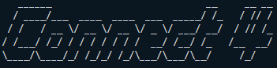
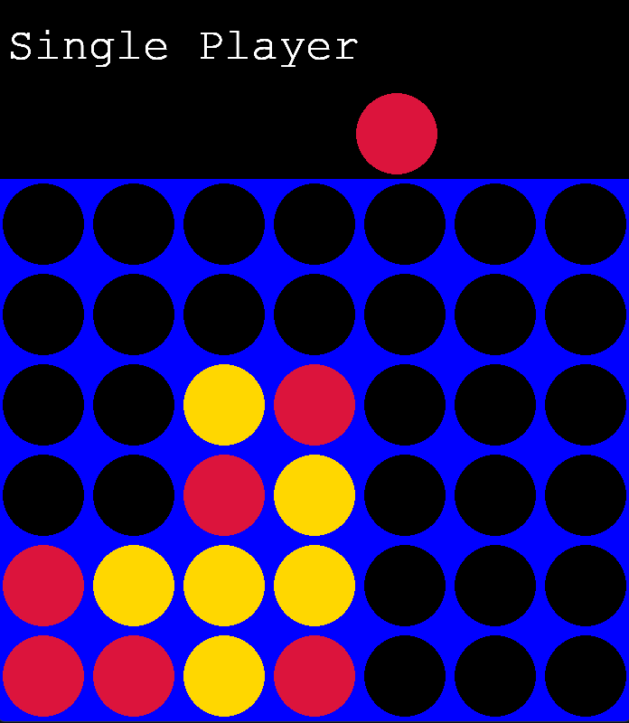
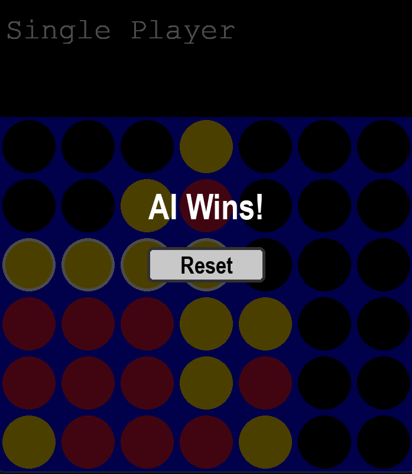

# Connect 4 Game with Pygame



## Table of Contents

- [Introduction](#introduction)
- [Features](#features)
- [Installation](#installation)
- [How to Play](#how-to-play)
- [Screenshots](#screenshots)
- [Technologies Used](#technologies-used)
- [Contributing](#contributing)
- [License](#license)
- [Acknowledgements](#acknowledgements)

## Introduction

Welcome to **Connect 4**, a classic two-player connection game implemented using Python and Pygame. Whether you're playing against a friend or challenging our intelligent AI opponent powered by the Minimax algorithm, Connect 4 offers engaging and strategic gameplay for all ages.

## Features

- **Single-Player Mode:** Play against an AI opponent with adjustable difficulty levels.
- **Two-Player Mode:** Compete against a friend on the same device.
- **AI Opponent:** Utilizes the Minimax algorithm with Alpha-Beta pruning for optimal moves.
- **Reset Button:** Easily restart the game after a win or a draw without restarting the application.
- **Enhanced Win Messages:** Visually appealing and informative messages displayed upon game conclusion.
- **Winning Sequence Highlight:** The four connected discs that lead to a win are distinctly highlighted.
- **Responsive GUI:** Smooth and interactive graphical user interface built with Pygame.

## Installation

### Prerequisites

- **Python 3.6 or higher**: Download and install from [python.org](https://www.python.org/downloads/).
- **Pygame Library**: Install using `pip`.

### Steps

1. **Clone the Repository**

   ```bash
   git clone https://github.com/yourusername/connect4-pygame.git
   cd connect4-pygame
   ```

2. **Create a Virtual Environment (Optional but Recommended)**

   ```bash
   python -m venv venv
   source venv/bin/activate  # On Windows: venv\Scripts\activate
   ```

3. **Install Dependencies**

   ```bash
   pip install -r requirements.txt
   ```

   *If a `requirements.txt` file is not present, install Pygame directly:*

   ```bash
   pip install pygame
   ```

4. **Run the Game**

   ```bash
   python connect4.py
   ```

## How to Play

1. **Starting the Game**

   - Upon launching, the game starts in **Single-Player Mode** by default, where you can play against the AI.

2. **Player Turns**

   - **Player 1:** Uses **Red** discs.
   - **Player 2 / AI:** Uses **Yellow** discs.

3. **Making a Move**

   - Move your mouse to the desired column. A disc preview will follow your cursor.
   - Click on the column where you want to drop your disc.

4. **Winning the Game**

   - The first player to connect four discs horizontally, vertically, or diagonally wins.
   - A visually enhanced message will appear, highlighting the winning sequence.
   - Click the **Reset** button to start a new game.

5. **Resetting the Game**

   - After a game concludes, a **Reset** button appears.
   - Click the **Reset** button to clear the board and begin a new match.

6. **Exiting the Game**

   - Close the game window or press the close button to exit.

## Screenshots

### 1. **Main Menu**


*The initial screen where players can choose between Single-Player and Two-Player modes.*

### 2. **Gameplay**



*During the game, players take turns dropping discs into the board.*

### 3. **Win Screen**



*Displayed when a player wins, highlighting the winning sequence and offering a Reset option.*

> **Note:** Place your screenshot images in a `screenshots` folder within the project directory and name them accordingly (e.g., `main_menu.png`, `gameplay.png`, `win_screen.png`).

## Technologies Used

- **Python 3.6+**
- **Pygame**: For creating the graphical user interface and handling game mechanics.
- **NumPy**: For efficient board state management and operations.

## Contributing

Contributions are welcome! If you'd like to improve the game, follow these steps:

1. **Fork the Repository**

2. **Create a Feature Branch**

   ```bash
   git checkout -b feature/YourFeature
   ```

3. **Commit Your Changes**

   ```bash
   git commit -m "Add some feature"
   ```

4. **Push to the Branch**

   ```bash
   git push origin feature/YourFeature
   ```

5. **Open a Pull Request**

## Acknowledgements

- **Pygame Documentation:** For providing comprehensive guides and references.